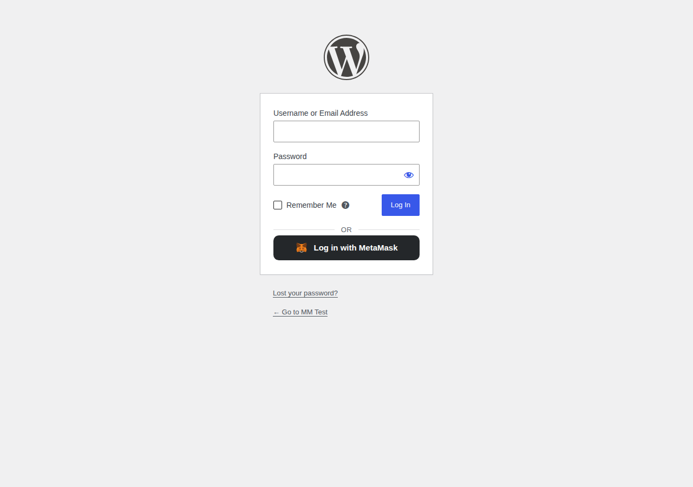
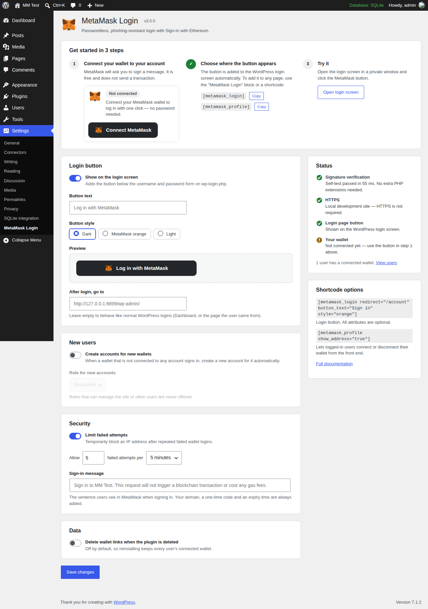
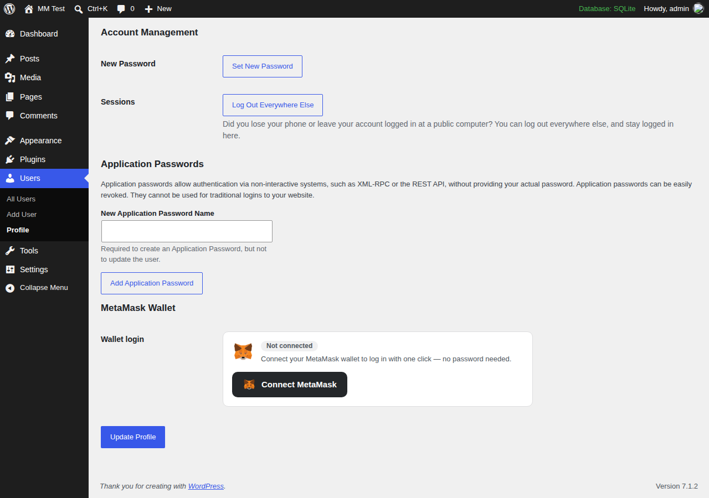
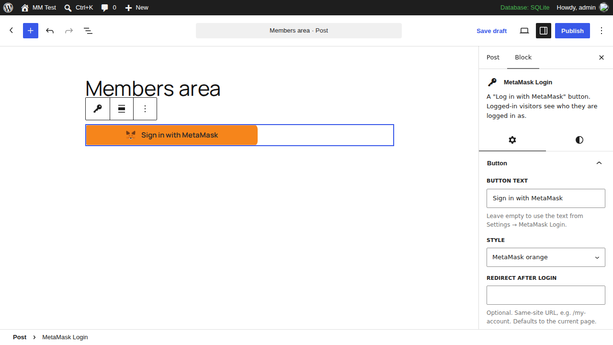

# MetaMask Login Add-On for WordPress

**Version 3.0.0** · Passwordless, phishing-resistant WordPress login with MetaMask

[](https://wordpress.org/)
[](https://php.net/)
[](https://www.gnu.org/licenses/gpl-2.0.html)

People click **Log in with MetaMask**, approve a free signature in their wallet, and they're in. Nothing is sent to the blockchain and no passwords are involved.

The plugin uses the **Sign-In with Ethereum** standard ([EIP-4361](https://eips.ethereum.org/EIPS/eip-4361)). WordPress checks every signature itself with built-in secp256k1 code, so you don't need any PHP extensions, Composer packages or outside services.



---

## Contents

- [Features](#features)
- [Requirements](#requirements)
- [Installation](#installation)
- [Setup in 3 steps](#setup-in-3-steps)
- [Adding the button to your site](#adding-the-button-to-your-site)
- [Settings reference](#settings-reference)
- [How it works](#how-it-works)
- [Developers](#developers)
- [Testing](#testing)
- [Troubleshooting](#troubleshooting)
- [Upgrading from 2.x](#upgrading-from-2x)
- [Documentation](#documentation)
- [License](#license)

## Features

**For site visitors**
- One-click login from the WordPress login screen, any page (block), or any shortcode area.
- Clear step-by-step messages ("Please confirm the signature request in MetaMask…").
- Helpful fallbacks: a desktop browser without a wallet gets an **Install MetaMask** link, and a phone gets **Open in the MetaMask app**.
- Works when several wallets are installed. MetaMask is chosen through [EIP-6963](https://eips.ethereum.org/EIPS/eip-6963) discovery.
- Connect, switch or disconnect a wallet from **Users → Profile**, or on the front end with `[metamask_profile]`.

**For site owners**
- A setup screen with a **3-step checklist** and live **status checks**: signature engine self-test, HTTPS, login button, and whether your own wallet is connected.
- A button text and style picker (dark, MetaMask orange, light) with a **live preview**.
- Optional **automatic sign-up** for new wallets. Administrator-level roles can never be picked for new accounts.
- **Rate limiting** of failed attempts per IP, adjustable.
- A **MetaMask Wallet** column in the Users list.
- A **"MetaMask Login" block** for the block editor (block API v3, iframe-editor ready).

**Security**
- Real on-server `personal_sign` verification (Keccak-256 + secp256k1 public key recovery) in pure PHP.
- One-time challenges. Each sign-in message has a random nonce, expires after 5 minutes, and is deleted atomically on first use, so a captured signature can't be replayed.
- Each challenge is tied to the browser that asked for it (a `SameSite=Strict` cookie). This blocks login CSRF and keeps the button working on cached pages.
- Wallet logins go through core's `wp_authenticate_user` filter and the multisite spam check, so ban, approval and lockout plugins still apply.
- Domain binding (EIP-4361). MetaMask warns users if a look-alike site asks them to sign your site's login message.
- Only same-site redirects are allowed. Nonces are checked on every AJAX call and all output is escaped.

## Requirements

| | |
|---|---|
| WordPress | 6.5 or newer (tested up to **7.1**) |
| PHP | 7.4 or newer, **64-bit** (standard on all modern hosts) |
| PHP extensions | None beyond WordPress's own (GMP/BCMath are **not** required) |
| Browser | MetaMask extension, the MetaMask mobile app browser, or another EIP-1193 wallet |
| HTTPS | Strongly recommended in production (not needed on `localhost`) |

## Installation

**From a ZIP file**
1. Download the plugin ZIP.
2. In WordPress go to **Plugins → Add New Plugin → Upload Plugin**, choose the ZIP and click **Install Now**.
3. Click **Activate**.

**Manually**
1. Copy the `metamask-login-addon` folder into `wp-content/plugins/`.
2. Activate **MetaMask Login Add-On** under **Plugins**.

After activation a notice with a **Finish setup** button appears on the Dashboard and Plugins screens.

## Setup in 3 steps

Open **Settings → MetaMask Login**.



1. **Connect your wallet.** Click **Connect MetaMask** and approve the signature. Your administrator account can now log in with MetaMask.
2. **Choose where the button appears.** It's already on the WordPress login screen. You can add it to other pages with the block or a shortcode (see below).
3. **Try it.** Click **Open login screen**, ideally in a private window, and log in with MetaMask.

The **Status** panel on the right confirms that signature verification works on your server.

Each user connects their own wallet from **Users → Profile → MetaMask Wallet**:



> An administrator can **disconnect** another user's wallet but can't connect one for them. Connecting always needs the wallet owner's signature.

## Adding the button to your site

### Block

In the block editor, add the **MetaMask Login** block (search for "MetaMask"). In the sidebar you can set the button text, the style and where to go after login. Logged-in visitors see "You are logged in as …" with a log-out link.



### Shortcodes

```text
[metamask_login]
[metamask_login redirect="/my-account" button_text="Sign in with Web3" style="orange"]
[metamask_profile]
[metamask_profile show_address="true" show_balance="true"]
```

| Shortcode | Attribute | Default | Description |
|---|---|---|---|
| `[metamask_login]` | `redirect` | current page | Same-site URL to open after login |
| | `button_text` | setting | Button label |
| | `style` | setting | `dark`, `orange` or `light` |
| | `button_class` | — | Extra CSS classes |
| `[metamask_profile]` | `show_address` | `true` | Show the connected address |
| | `show_balance` | `false` | Show the ETH balance, read from the visitor's wallet |

### Theme templates

To change the markup, copy `templates/login-button.php` or `templates/user-profile.php` to `your-theme/metamask-login/` and edit the copy.

## Settings reference

| Setting | Default | What it does |
|---|---|---|
| Show on the login screen | On | Adds the button below the wp-login.php form |
| Button text | "Log in with MetaMask" | Label everywhere unless a block or shortcode overrides it |
| Button style | Dark | Dark, MetaMask orange or light |
| After login, go to | empty | Fixed destination. Empty means WordPress's normal behaviour: `redirect_to`, the Dashboard for editors, or the Profile page for subscribers |
| Create accounts for new wallets | Off | Unknown wallets get a new account instead of an error |
| Role for new accounts | Subscriber | Only roles without privileged capabilities are offered: no admins, editors, or user, plugin or theme managers |
| Limit failed attempts | On, 5 per 5 minutes | Per-IP limit on failed wallet logins |
| Sign-in message | "Sign in to {site}…" | The sentence shown inside MetaMask |
| Delete wallet links when the plugin is deleted | Off | When on, uninstalling also removes every user's connected wallet |

## How it works

```
Browser                                   WordPress
───────                                   ─────────
eth_requestAccounts ──► address
POST metamask_get_nonce(address, chainId) ─► stores a one-time SIWE message
                                             (5 min TTL, bound to a browser cookie)
personal_sign(message) ◄── message
POST metamask_authentication(address, nonce, signature)
                                          ─► deletes the challenge (single use)
                                             recovers signer with secp256k1
                                             finds user by wallet → wp_set_auth_cookie
                          ◄── redirect URL
```

Example of the message users sign:

```text
example.com wants you to sign in with your Ethereum account:
0x5aAeb6053F3E94C9b9A09f33669435E7Ef1BeAed

Sign in to Example Site. This request will not trigger a blockchain transaction or cost any gas fees.

URI: https://example.com/
Version: 1
Chain ID: 1
Nonce: 3Jb9sXk2QmPz7LwRt
Issued At: 2026-09-28T12:00:00Z
Expiration Time: 2026-09-28T12:05:00Z
```

[docs/security.md](docs/security.md) explains the design in detail.

## Developers

The [developer guide](docs/developer-guide.md) covers everything below in full. In short:

```php
// Find the user for a wallet.
$user = MetaMask_User_Profile::get_user_by_wallet_address( '0x…' );

// Read a user's wallet (lowercase, '' if none).
$address = MetaMask_User_Profile::get_wallet_address( $user_id );

// Send wallet logins somewhere specific.
add_filter( 'metamask_login_redirect', function ( $url, $user ) {
	return home_url( '/dashboard/' );
}, 10, 2 );

// Block wallet logins for some users.
add_filter( 'metamask_login_authenticate', function ( $user, $address ) {
	return user_can( $user, 'manage_options' ) ? new WP_Error( 'denied', 'Admins must use a password.' ) : $user;
}, 10, 2 );
```

**Filters:** `metamask_login_redirect`, `metamask_login_default_redirect`, `metamask_login_authenticate`, `metamask_login_sign_message`, `metamask_login_siwe_domain`, `metamask_login_new_username`, `metamask_login_privileged_caps`, `metamask_login_client_ip`, `metamask_login_bind_challenge_to_cookie`, `metamask_login_show_on_login_page`, `metamask_login_template`, `metamask_login_custom_signature_verify`.

**Actions:** `metamask_login_successful`, `metamask_login_failed`, `metamask_user_registered`, `metamask_wallet_connected`, `metamask_wallet_updated`, `metamask_wallet_disconnected`.

**REST API** (`/wp-json/metamask-login/v1`): `POST /nonce`, `POST /auth`, `POST /link`, `POST /unlink`, `GET /me`.

## Testing

```bash
# PHP unit tests (Keccak, secp256k1, EIP-55, signature verification)
composer install
composer test

# End-to-end tests against a running WordPress site with the plugin active
cd tests/e2e
npm install
WP_BASE_URL=http://localhost:8889 WP_ADMIN_USER=admin WP_ADMIN_PASS=password npx playwright test
```

The e2e suite puts a mock MetaMask provider into the browser. The mock signs with real ethers.js keys, so the tests exercise the full login, link, replay, forgery, registration, REST and rate-limit flows. [docs/testing.md](docs/testing.md) has the details.

Release 3.0.0 was verified on **WordPress 7.1.2** (latest) and **WordPress 6.5.12** (minimum) with PHP 8.4: 19 PHPUnit tests and 17 Playwright tests pass on both, with no PHP notices from the plugin.

## Troubleshooting

| Problem | Fix |
|---|---|
| "MetaMask was not detected" | Install MetaMask, or on a phone tap **Open in the MetaMask app**. |
| "This wallet is not connected to an account yet" | Log in with your password once, then click **Connect MetaMask** under **Users → Profile**. You can also turn on **Create accounts for new wallets**. |
| "This sign-in request has expired or was already used" | Try again. Challenges last 5 minutes and work once. If it keeps happening, make sure your cache or CDN doesn't strip cookies on `admin-ajax.php`. |
| "Your session has expired" | The page was served from a cache older than 24 hours. Reload it, or exclude pages with the button from full-page caching. |
| "Too many attempts" | Wait for the rate-limit window to end, or change it under **Security**. Behind a proxy or CDN, pass the real client IP through `metamask_login_client_ip`. |
| MetaMask warns about a "deceptive site" or domain mismatch | The site URL (Settings → General) must match the domain in the address bar. For special setups, filter `metamask_login_siwe_domain`. |
| Status shows "Signature verification" failing | Your PHP is 32-bit, or another plugin filters `metamask_login_custom_signature_verify`. |

## Upgrading from 2.x

3.0.0 is a major release, but upgrading is automatic:

- Settings are migrated. *Custom sign message* becomes *Sign-in message*, and the unused *dev mode* and *require verification* options are removed.
- **Wallet links saved by 2.x are set aside as unverified.** 2.x let users type any address into their profile without proving they owned it, so those links can't be used to log in. Each affected user sees a note on their profile and confirms the wallet with one click on **Connect MetaMask**.
- **Behaviour changes:**
  - Uninstalling no longer deletes wallet links unless you turn that on.
  - The text domain is now `metamask-login-addon`.
  - Clients must sign the challenge from `/nonce` or `metamask_get_nonce`. Arbitrary self-made messages are rejected. Legacy clients that send `message` still work as long as it contains the `Nonce:` line.
  - The unused `/verify` REST route, the `authenticate` filter integration and the unverified `token` in `/auth` responses were removed.
  - REST errors now use the standard WordPress `{ code, message, data.status }` format.
- 2.x couldn't actually verify signatures, so wallet login never worked there. Nothing that used to work is lost.

The [CHANGELOG](CHANGELOG.md) lists every change.

## Documentation

- [Getting started](docs/getting-started.md): step-by-step guide for site owners
- [Developer guide](docs/developer-guide.md): hooks, REST API, templates, JavaScript
- [Security model](docs/security.md): how signatures are verified and what is protected
- [Testing](docs/testing.md): unit and end-to-end tests
- [Changelog](CHANGELOG.md)

## License

GPL v2 or later. See [LICENSE](https://www.gnu.org/licenses/gpl-2.0.html).

Developed by [blocLabs.io](https://bloclabs.io).

MetaMask is a trademark of Consensys Software Inc. This plugin is not affiliated with or endorsed by Consensys.
